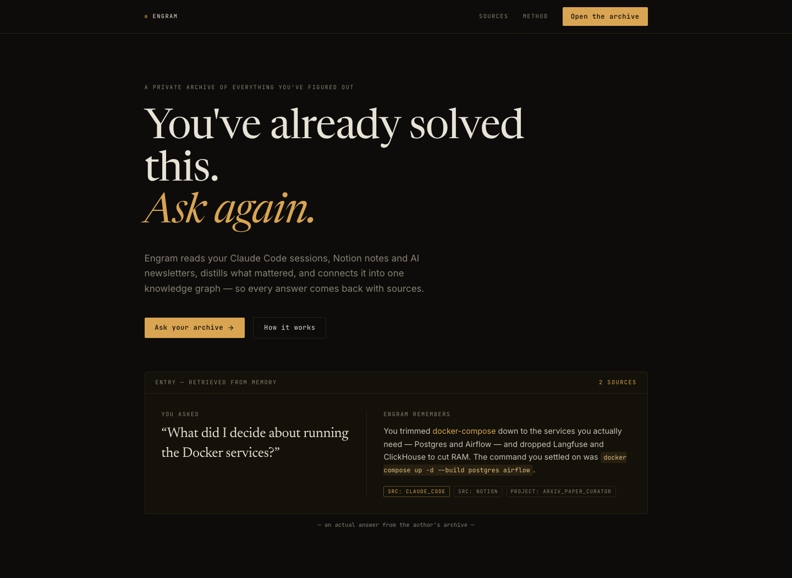
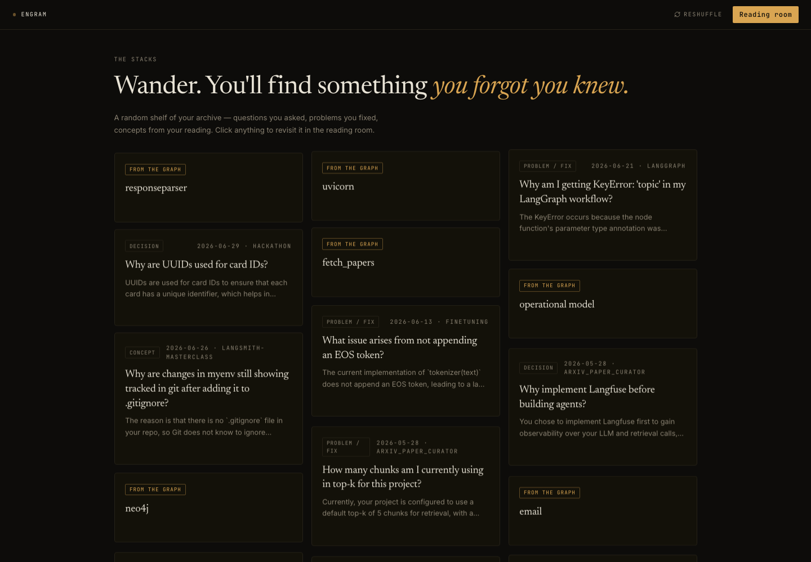
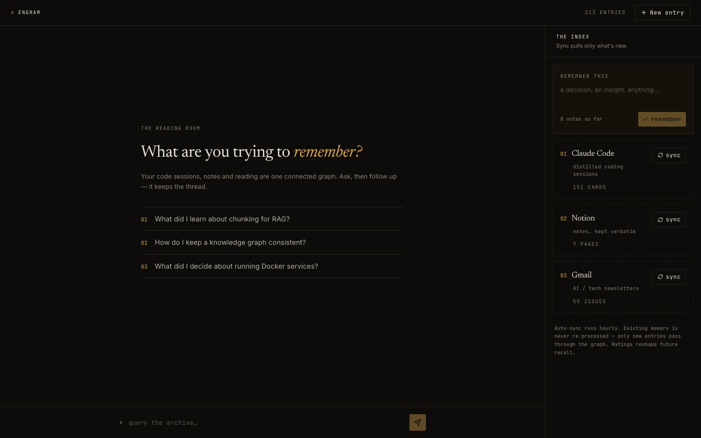
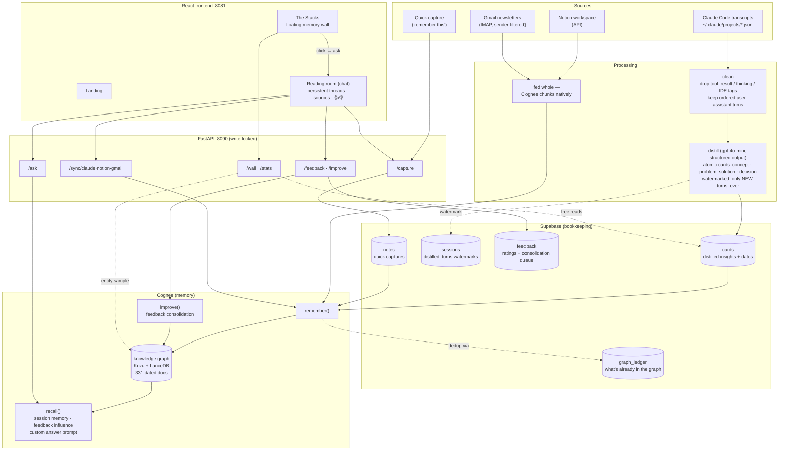
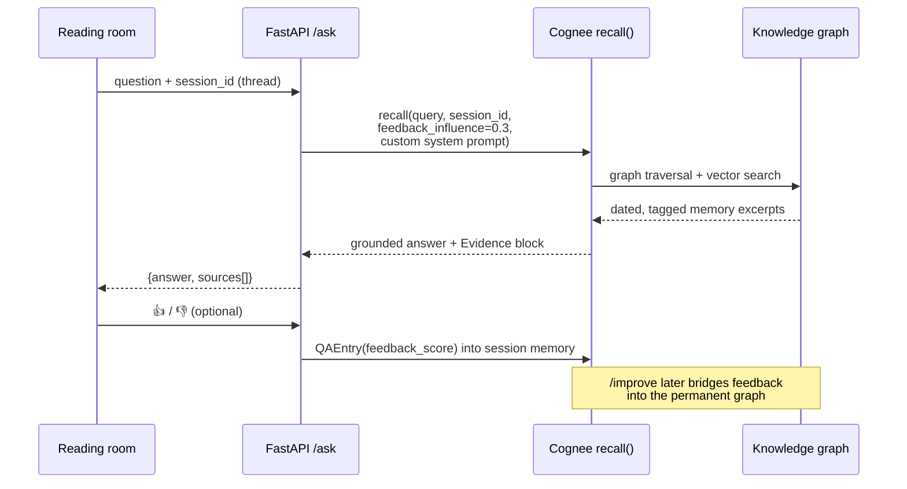

# Engram

**A private archive of everything you've figured out.**

Engram reads your Claude Code sessions, Notion notes, and the AI newsletters you actually read — distills what mattered, connects it into one [Cognee](https://www.cognee.ai/) knowledge graph, and answers your questions **with sources and dates**. Ask "how did I fix that CORS error?" or "what did I decide about Docker services?" and it remembers, cites, and learns from your feedback.

> You've already solved this. *Ask again.*



---

## Why this exists

You ask Claude a great question, get a great answer — and re-ask the same question three weeks later. Every developer's knowledge is scattered across chat transcripts, notes, and newsletters that are never looked at again. Engram turns that exhaust into a queryable, *living* memory:

- **Not search — memory.** A vector DB retrieves the nearest paragraph. A knowledge graph walks from the article you read, to the concept it taught you, to the decision you made because of it.
- **Cross-source answers.** One question can pull evidence from a debugging session (Claude), your own write-up (Notion), *and* a newsletter (Gmail) — because they live in one graph.
- **It learns.** Thumbs up/down feed Cognee's feedback weighting; `improve()` consolidates it into the permanent graph.

## Features

| Feature | What it does |
|---|---|
| **Unified knowledge graph** | All sources in one Cognee graph (`remember`/`recall`), cheap models (`gpt-4o-mini` + `text-embedding-3-small`) |
| **Transcript distillation** | Raw Claude logs are ~90% tool noise. A pipeline cleans them and distills atomic insight cards (`concept` / `problem_solution` / `decision`) via structured LLM output |
| **Dated memory** | Every doc carries `[Date: …]` — temporal recall ("what did I decide recently?") works |
| **Conversational threads** | `session_id` gives multi-turn context ("what's the difference between *both*?" resolves); threads persist across restarts |
| **Feedback loop** | 👍/👎 on any answer → Cognee session memory + `recall(feedback_influence)`; `/improve` bridges it into the graph |
| **Quick capture** | "Remember this" box — one thought straight into the graph, dated |
| **The Stacks** | A browsable wall of floating memory cards (questions you asked + graph concepts) for rediscovering what you forgot — free to browse, click to revisit in chat |
| **Incremental everything** | Turn-level watermarks (Claude), a durable graph ledger (Supabase) — nothing is ever distilled or embedded twice |
| **Golden eval** | 10 known-answer questions scoring the whole pipeline (currently **9/10**) |




---

## Architecture



**The core design rule:** *Cognee is the memory; Supabase is the bookkeeping.* Anything expensive to compute (distilled cards) or stateful (watermarks, ledger, feedback queue) is durable in Postgres; anything re-fetchable (Notion pages, newsletters) goes straight to `remember()`.

### Ask flow



### Why each source is processed differently

| Source | Path | Reason |
|---|---|---|
| Claude transcripts | clean → distill → cards → graph | Raw logs are ~90% noise; naive ingestion poisons the graph (measured). Distillation is expensive → cards persisted so rebuilds never re-pay it |
| Notion / Gmail | straight to `remember()` | Already human-curated; Cognee chunks natively — pre-chunking was measured to *triple* ingestion cost |
| Quick notes | Supabase + `remember()` | Durable copy first, so graph rebuilds don't destroy them |

---

## Getting started

### Prerequisites

- Python 3.12 + [uv](https://docs.astral.sh/uv/) · [bun](https://bun.sh) · a Supabase project · an OpenAI API key
- Optional sources: Notion integration token, Gmail app password

### 1. Environment

```bash
uv sync                     # backend deps
cd frontend && bun install  # frontend deps
```

`.env` at repo root:

```bash
LLM_API_KEY=sk-...                  # OpenAI (LLM + embeddings)
ENABLE_BACKEND_ACCESS_CONTROL=false # single-user Cognee
SUPABASE_URL=https://<ref>.supabase.co
SUPABASE_SECRET_KEY=...             # service role (server-side only)
NOTION_API_KEY=ntn_...              # optional
GMAIL_ADDRESS=you@gmail.com         # optional (needs 2FA app password)
GMAIL_APP_PASSWORD=...
# AUTO_SYNC_MINUTES=60              # opt-in background sync (default: off)
```

Newsletter senders are configured in `backend/config.py` (`NEWSLETTER_SENDERS`).

### 2. Supabase schema

Run the SQL in the docstring of [`backend/db/supabase_client.py`](backend/db/supabase_client.py) (tables: `cards`, `sessions`, `graph_ledger`, `feedback`, `notes`).

### 3. Build the brain

```bash
# distill Claude transcripts -> cards (incremental, watermarked)
uv run python backend/ingestion/claude_transcripts/pipeline.py

# build the unified graph from all sources
uv run python backend/memory/cognee_client.py build
```

### 4. Run

```bash
uv run python backend/api/main.py      # API on :8090
cd frontend && bun run dev             # UI on :8080/:8081
```

Open the app → ask, sync, capture, rate, wander The Stacks.

### 5. Evaluate

```bash
uv run python backend/eval/golden_eval.py   # 10 golden questions vs the live API
```

---

## Project structure

```
backend/
├── api/main.py                     # FastAPI: ask/sync/capture/feedback/improve/wall/stats
├── config.py                       # settings + newsletter senders
├── db/supabase_client.py           # cards, watermarks, ledger, feedback, notes (+ schema SQL)
├── ingestion/
│   ├── claude_transcripts/         # client (clean) → distiller (cards) → pipeline (watermarked)
│   ├── notion/                     # client + factory (fed straight to Cognee)
│   └── gmail/                      # IMAP client + factory (sender-filtered)
├── memory/cognee_client.py         # THE brain: build/sync/ask/capture/feedback/wall/stats
├── models/                         # pydantic schemas per source
└── eval/golden_eval.py             # 10-question regression eval

frontend/src/routes/
├── index.tsx                       # landing ("the archive")
├── app.tsx                         # reading room: chat, sync, capture, feedback
└── wall.tsx                        # The Stacks: floating memory cards
```

## Engineering notes (learned the hard way)

- **Cognee does not dedup on `remember()`** — proven empirically (re-ingesting a doc doubles its nodes). Hence the durable `graph_ledger`: only never-seen docs pass through.
- **Cognee's stores are single-process** (Kuzu lock). The API owns them; never run ingest scripts or `cognee-cli -ui` while it's serving.
- **Changing embedding models requires a full rebuild** — vector dimensions are baked into the store (3072 → 1536 taught us this via a Rust panic).
- **Session memory ≠ graph memory.** The graph knows *what you know*; `session_id` makes the chat know *what you just said*. You need both.
- **Costs are controlled by design:** cheap models pinned, incremental sync everywhere, manual-by-default syncing, browsing The Stacks is zero-LLM. The only recurring spend is questions you actually ask.

## Stack

Cognee · FastAPI · Supabase · OpenAI (gpt-4o-mini, text-embedding-3-small) · LangChain (structured distillation) · React + TanStack Start · Tailwind v4

---

*Built for a Cognee hackathon — one person's real transcripts, notes, and reading, turned into a brain that answers with receipts.*
